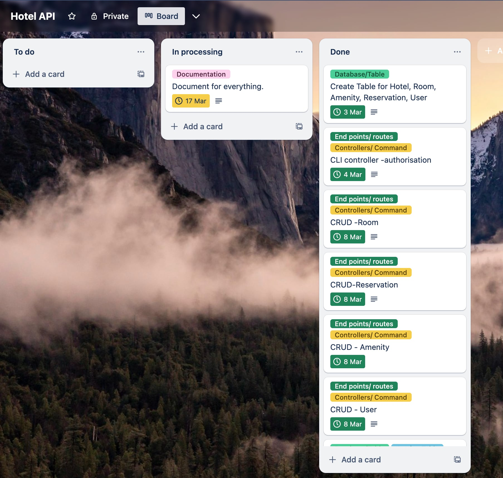

# How to run
To run the app, run the following scripts
* `src/run_reseed_db.sh` - to set up some mock data in the database
* `src/run_app.sh` - to run the flask app
# R1 Identification of the problem you are trying to solve by building this particular app.
For nowadays most organizations in the hotel industry are experiencing poor booking management systems. Below are some problem:
* Lack of efficiency - The big amount of manual booking such as phone booking, in person booking, email booking is really low efficiency, it will cause delays to the booking. Instead we should encourage the customer to use online booking systems to reduce the labor and make booking more efficient. 
* Poor real time access - Customers can not access the updated data in real time, so issues such as double booking for the same room in the same period of time become frustrations for the customers and staff. We should make sure the room data is updated in real time then the customer can view the room availability in real time as well.
* Poor room utilization - Some of the rooms may not get used as much. The system did not rotate that room to be used resulting in some rooms that never get used. For a more advanced version of this app we chould consider a rotation loop for the room when developing the application, so that the system can assign the rooms evenly. 
* Poor booking integrity - Most organizations are facing the poor booking management system, which can cause the management team to have conflits where multiple customers have booked the same room because of user error. We should develop a system that can detect the conflict and prevent the conflicts from occuring by automatically checking for conflicts.
* Lack of tracking and analysis reports - Some organizations lack the ability to track the booking status, causing them to not notice if booking was cancelled or the guest did not show up on the check in date. A more advanced version of this app could implement some calender notificaiton to both the customer and organiztion side.

# R2 Why is it a problem that needs solving?
Efficiency and booking management system is crucial for the hotel industry. With more and more people using the online system, and more and more competitor, it is very important that have a well designed booking management system to make sure customer are satisfied with booking experience. 

The customer satisfication is very import part, because once the customer is happy for the experience it will leads to a good review and more chance to come back for another stay, or the word of mouth to recommand to others. That will lead to more business for the company and more bookings in the competitive market. A lot of customers will also go somewhere else if the booking system is not easy and can be access online. And if the customer ends up having a conflict with another booking, this will make the customer very unhappy and will be bad for business for the hotel.

 A good online booking management system also reduces the need for people to manually enter and track the bookings which saves the company time and money. 

 A well developed booking management system also tracks and updates the room availability in a real time to avoid the booking conflicts and allows rooms to be made available immedietely after cancellation. For the pricing part, the system can analyse the market price and provide a well chosen market price to maximise the profit. Since the hotel industry market is very dynamic and competitive, it is very important to use a well developed booking management system to make sure the business is staying on track and remaining competitive with the competition.

# R3 Why have you chosen this database system. What are the drawbacks compared to others?
I have chosen postgreSQL as my database, because it is open source and costs nothing to use it. PostgreSQL has large built in functions and features that can handle different data needs. Also it has high performance on large scale application and is extensible to customize data needs. It also meets all my needs for the requirments of the booking management system.

From a developer point of view I also have experience with this database system so it will reduce the learning curve and increase the time to market for my api application in a competitive environment.

The drawbacks of postgreSQL :
* Using things like queries is not easy to learn for a beginner compared to other database like MySQL. So if more developers joined my project, it might take them time to be productive. 
* Because postgreSQL has rich built in features, it requires a more complicated configuration to set up compared to other databases. 
* Because postgreSQL is open source, when the database has problems, there is not as much support as some other databases. 

# R4 Identify and discuss the key functionalities and benefits of an ORM
An ORM is used to help interact between the application and the database. Below are the key functionalities and benefits of an ORM. 

### ORM key functionalities
* Handling Complicated Queries - An ORM framework has its own built-in functions that can abstract data with complicated queries. This helps developers save time as they don't have to spend time writing raw queries to the database.
Mapping Data - An ORM framework provides a mapping technique of object-oriented approach, allowing the mapping of class models to the relational database. It maps the data to the table, column, and row as an object. 
* Handling CRUD Operations - An ORM framework supports CRUD operations, which include create, read, update, and delete. This means it can simplify by the written code, as the ORM will translate the code into CRUD queries to the database. For example, it can use `session.delete(object)` to delete the whole object in the database.
* Relational Mapping - An ORM framework provides relational mapping relationships, such as one-to-one, one-to-many, and many-to-many.
* Database Independence - An ORM framework supports database independence, meaning the same code can be used for different databases.
* Performance Optimization - An ORM framework has built-in features to optimize runtime and reduce memory usage. For example, it includes built-in query lazy loading and caching.
* Validation and constraints - An ORM framework allows us to set the model data of constraints such as unique key, nullable, foreign key etc. Those constraints will also comes with validation, when the data does not match the data constraints or if the field does not match the data model, it will raise different validation error. ORM framework also allow the user to create owner validation according to their needs.
* Transaction management - An ORM framework allows grouping of multiple operations and commit all operations in one transaction. For example, when creating data in the table, it can add multiple tables, or one table with multiple objects, it can add all to add them to the stage area then just commit once, it will create all of them. If something goes wrong part way through, all the partially completed changes will not be commited to the database. This helps to ensure data integrity.

### Benefits of an ORM
* Reduces development time - An ORM framework provides high level functionality to implement the project. It handles complicated things suc as establishing the connection and interacting with the database in the background letting us to focus on application code instead. An ORM framework takes over the repetitive boilerplate code part, so the the developer can save time and spend it on other areas such as writing the app logic. 
* Productivity - An ORM framework provides a high level of abstraction to the database which save us lots of work on implementing the product. The developer can be more productive to work on other high level parts of the app instead of stuck on low-level database implementation. 
* Flexibility - An ORM framework is flexible which means it support multiple databases. When you need to migrate to a different database, it does not need you to rewrite large chunks of the code which provides flexibility to the development team. 
* Object Oreinted - An ORM framework maps the data to relational databases as an object-class concept. This makes it easy to understand and work with while doing development. 
* Reduce database attack - ORM framework has built-in parameterized queries, when the user try to query the database, it will automatic sanitise the data, avoiding a database injection attack. For example, it has built-in `query` and `.filter` to locate the data instead of go in the database directly to search the product such as `for product in products`, so using an ORM framework is more secure for the database. 
* Easy code maintenance and consistancy - Using an ORM framework makes the code more clean and easy to maintain and keep the code consistancy. For example, if we don't use an ORM to update the database, we will need to write some repeated data such as connection drives and database table and column names, it will create lots of repeated code which makes it harder to maintain. But with ORM scheme it will reduce all these problems, the ORM schema will automatically perform the changes and updates, it can also reduce the likehood of error.  
* Optimized performance - An ORM with its built-in framework, provides optimized performance features, such as lazy load, joined loading, etc to optimize the performance. For example, the joined loading query can connect to the join table with one query which it will use to join the table with the necessary data. An ORM can also retrieve the data more effectively and also minimized the data transfer within the database. 

# R5 Document all endpoints for your API

Documentation for these apis was generated with the assistance of ChatGPT 
All endpoint documentation was reviewed and edited to make correct.

## Room Endpoints

### GET rooms
- **URL:** `/rooms`
- **Method:** GET
- **Access:** Admin only
- **Return Status:** 
  - 200 OK: Rooms retrieved successfully.
  - 403 Forbidden: User not authorised.
- **Description:** Retrieves details of all rooms.
- **Output:** 
  - JSON array containing details of all rooms.
    - Each item in the array contains:
      - `id`: Unique identifier of the room.
      - `type`: Type of the room.
      - `price`: Price of the room.
      - `room_amenity`: List of amenities associated with the room.

### GET room
- **URL:** `/rooms/<int:room_id>`
- **Method:** GET
- **Access:** Admin only
- **Return Status:** 
  - 200 OK: Room details retrieved successfully.
  - 403 Forbidden: User not authorised.
  - 404 Not Found: Room with the specified ID does not exist.
- **Description:** Retrieves details of a specific room.
- **Output:** 
  - JSON object containing the details of the requested room.
    - `id`: Unique identifier of the room.
    - `type`: Type of the room.
    - `price`: Price of the room.
    - `room_amenity`: List of amenities associated with the room.

### CREATE room
- **URL:** `/rooms`
- **Method:** POST
- **Access:** Admin only
- **Return Status:** 
  - 200 OK: Room successfully created.
  - 400 Bad Request: Invalid input data.
  - 403 Forbidden: User not authorised.
  - 409 Conflict: Room already exists.
- **Description:** Creates a new room with the provided details.
- **Input:**
  - `type`: Type of the room (string, required). Must be one of: "King", "Queen", "Double", "Single".
  - `price`: Price of the room (integer, required). Must be greater than 0.
- **Output:** 
  - JSON object containing the details of the newly created room.
    - `id`: Unique identifier of the room.
    - `type`: Type of the room.
    - `price`: Price of the room.
    - `room_amenity`: List of amenities associated with the room.

### UPDATE room
- **URL:** `/rooms/<int:room_id>`
- **Method:** PUT or PATCH
- **Access:** Admin only
- **Return Status:** 
  - 200 OK: Room updated successfully.
  - 400 Bad Request: Invalid input data.
  - 403 Forbidden: User not authorised.
  - 404 Not Found: Room with the specified ID does not exist.
- **Description:** Updates details of a specific room.
- **Input:**
  - `type`: Updated type of the room (string). Must be one of: "King", "Queen", "Double", "Single".
  - `price`: Updated price of the room (integer). Must be greater than 0.
- **Output:** 
  - JSON object containing the updated details of the room.
    - `id`: Unique identifier of the room.
    - `type`: Updated type of the room.
    - `price`: Updated price of the room.
    - `room_amenity`: List of amenities associated with the room.

### DELETE room
- **URL:** `/rooms/<int:room_id>`
- **Method:** DELETE
- **Access:** Admin only
- **Return Status:** 
  - 200 OK: Room deleted successfully.
  - 403 Forbidden: User not authorised.
  - 404 Not Found: Room with the specified ID does not exist.
  - 409 Conflict: Room cannot be deleted due to existing reservations or amenity assignments.
- **Description:** Deletes a specific room.
- **Output:** 
  - JSON object confirming the deletion of the room.

### Get Room Reservations
- **URL:** `/rooms/<int:room_id>/reservations`
- **Method:** GET
- **Access:** Admin only
- **Return Status:** 
  - 200 OK: Room reservations retrieved successfully.
  - 403 Forbidden: User not authorised.
  - 404 Not Found: Room with the specified ID does not exist.
- **Description:** Retrieves all reservations associated with a specific room.
- **Output:** 
  - JSON array containing details of all reservations associated with the specified room.
    - Each item in the array contains details of a reservation:
      - `id`: Unique identifier of the reservation.
      - `check_in_date`: Date of check-in for the reservation (yyyy-mm-dd).
      - `check_out_date`: Date of check-out for the reservation (yyyy-mm-dd).
      - `total_cost`: Total cost of the reservation.
      - `user_reservation`: List of details for each user associated with the reservation.
      - `room_reservation`: List of details for each room of the reservation.

## Amenity Endpoints

### Get amenities
- **URL:** `/amenities`
- **Method:** GET
- **Access:** Admin only
- **Return Status:** 
  - 200 OK: Amenities retrieved successfully.
  - 403 Forbidden: User not authorised.
- **Description:** Retrieves details of all amenities.
- **Output:** 
  - JSON array containing details of all amenities.
    - Each item in the array contains:
      - `id`: Unique identifier of the amenity.
      - `name`: Name of the amenity.
      - `description`: Description of the amenity.

### Get amenity
- **URL:** `/amenities/<int:amenity_id>`
- **Method:** GET
- **Access:** Admin only
- **Return Status:** 
  - 200 OK: Amenity details retrieved successfully.
  - 403 Forbidden: User not authorised.
  - 404 Not Found: Amenity with the specified ID does not exist.
- **Description:** Retrieves details of a specific amenity.
- **Output:** 
  - JSON object containing the details of the requested amenity.
    - `id`: Unique identifier of the amenity.
    - `name`: Name of the amenity.
    - `description`: Description of the amenity.

### Create amenity
- **URL:** `/amenities`
- **Method:** POST
- **Access:** Admin only
- **Return Status:** 
  - 201 Created: Amenity successfully created.
  - 400 Bad Request: Invalid input data.
  - 403 Forbidden: User not authorised.
  - 409 Conflict: Amenity with the same name already exists.
- **Description:** Creates a new amenity with the provided details.
- **Input:**
  - `name`: Name of the amenity (string, required). Must be one of: "Swimming pool", "Gymnasium", "Hotel breakfast", "Day spa", "Shuttle bus".
  - `description`: Description of the amenity (string, required).
- **Output:** 
  - JSON object containing the details of the newly created amenity.
    - `id`: Unique identifier of the amenity.
    - `name`: Name of the amenity.
    - `description`: Description of the amenity.

### Update amenity
- **URL:** `/amenities/<int:amenity_id>`
- **Method:** PUT or PATCH
- **Access:** Admin only
- **Return Status:** 
  - 200 OK: Amenity updated successfully.
  - 400 Bad Request: Invalid input data.
  - 403 Forbidden: User not authorised.
  - 404 Not Found: Amenity with the specified ID does not exist.
- **Description:** Updates details of a specific amenity.
- **Input:**
  - `name`: Updated name of the amenity (string). Must be one of: "Swimming pool", "Gymnasium", "Hotel breakfast", "Day spa", "Shuttle bus".
  - `description`: Updated description of the amenity (string).
- **Output:** 
  - JSON object containing the updated details of the amenity.
    - `id`: Unique identifier of the amenity.
    - `name`: Updated name of the amenity.
    - `description`: Updated description of the amenity.

### Delete amenity
- **URL:** `/amenities/<int:amenity_id>`
- **Method:** DELETE
- **Access:** Admin only
- **Return Status:** 
  - 200 OK: Amenity deleted successfully.
  - 403 Forbidden: User not authorised.
  - 404 Not Found: Amenity with the specified ID does not exist.
  - 409 Conflict: Amenity cannot be deleted due to existing room assignments.
- **Description:** Deletes a specific amenity.
- **Output:** 
  - JSON object confirming the deletion of the amenity.

## User Endpoints

### Register user
- **URL:** `/auth/register`
- **Method:** POST
- **Access:** Anyone
- **Return Status:** 
  - 201 Created: User successfully registered.
  - 400 Bad Request: Invalid input data.
  - 409 Conflict: Email is already in use.
- **Description:** Registers a new user with the provided details.
- **Input:**
  - `first_name`: First name of the user (string, required). Must be at least 2 characters long and contain only alphabetic characters.
  - `last_name`: Last name of the user (string, required). Must be at least 2 characters long and contain only alphabetic characters.
  - `email`: Email address of the user (string, required). Must be a valid email format.
  - `password`: Password of the user (string, required). Must be at least 6 characters long.
- **Output:** 
  - JSON object containing the details of the newly registered user.
    - `id`: Unique identifier of the user.
    - `first_name`: First name of the user.
    - `last_name`: Last name of the user.
    - `email`: Email address of the user.
    - `is_admin`: Indicates whether the user is an administrator.

### Login user
- **URL:** `/auth/login`
- **Method:** POST
- **Access:** Anyone can access this endpoint
- **Return Status:** 
  - 200 OK: User successfully logged in.
  - 401 Unauthorized: Invalid email or password.
- **Description:** Logs in a registered user.
- **Input:**
  - `email`: Email address of the user (string, required).
  - `password`: Password of the user (string, required).
- **Output:** 
  - JSON object containing the user's email and authentication token.
    - `email`: Email address of the user.
    - `token`: Authentication token for accessing protected endpoints.
    - `is_admin`: Indicates whether the user is an administrator.

### Get users
- **URL:** `/users/`
- **Method:** GET
- **Access:** Admin only
- **Return Status:** 
  - 200 OK: Users retrieved successfully.
  - 403 Forbidden: User not authorised.
- **Description:** Retrieves details of all registered users. (Only accessible to administrators)
- **Output:** 
  - JSON array containing details of all registered users.
    - Each item in the array contains:
      - `first_name`: First name of the user.
      - `last_name`: Last name of the user.
      - `email`: Email address of the user.
      - `is_admin`: Indicates whether the user is an administrator.

### Get user
- **URL:** `/users/<int:user_id>`
- **Method:** GET
- **Access:** Admin and the user owner
- **Return Status:** 
  - 200 OK: User details retrieved successfully.
  - 403 Forbidden: User not authorised.
  - 404 Not Found: User with the specified ID does not exist.
- **Description:** Retrieves details of a specific user.
- **Output:** 
  - JSON object containing the details of the requested user.
    - `first_name`: First name of the user.
    - `last_name`: Last name of the user.
    - `email`: Email address of the user.
    - `is_admin`: Indicates whether the user is an administrator.

### Update user
- **URL:** `/users/<int:user_id>`
- **Method:** PUT or PATCH
- **Access:** Admin and the user owner
- **Return Status:** 
  - 200 OK: User updated successfully.
  - 400 Bad Request: Invalid input data.
  - 403 Forbidden: User not authorised.
  - 404 Not Found: User with the specified ID does not exist.
- **Description:** Updates details of a specific user.
- **Input:**
  - `first_name`: Updated first name of the user (string).
  - `last_name`: Updated last name of the user (string).
  - `email`: Updated email address of the user (string). Must be unique.
  - `password`: Updated password of the user (string).
- **Output:** 
  - JSON object containing the updated details of the user.
    - `id`: Unique identifier of the user.
    - `first_name`: Updated first name of the user.
    - `last_name`: Updated last name of the user.
    - `email`: Updated email address of the user.
    - `is_admin`: Indicates whether the user is an administrator.

### Delete user
- **URL:** `/users/<int:user_id>`
- **Method:** DELETE
- **Access:** Admin and the user owner
- **Return Status:** 
  - 200 OK: User deleted successfully.
  - 403 Forbidden: User not authorised.
  - 404 Not Found: User with the specified ID does not exist.
  - 409 Conflict: User has existing reservations.
- **Description:** Deletes a specific user.
- **Output:** 
  - JSON object confirming the deletion of the user.

## Reservation Endpoints

### Get reservations
- **URL:** `/reservations/`
- **Method:** GET
- **Access:** Admin only
- **Return Status:** 
  - 200 OK: Reservations retrieved successfully.
  - 403 Forbidden: User not authorised.
- **Description:** Retrieves details of all reservations. (Only accessible to administrators)
- **Output:** 
  - JSON array containing details of all reservations.
    - Each item in the array contains:
      - `id`: Unique identifier of the reservation.
      - `check_in_date`: Date of check-in for the reservation.
      - `check_out_date`: Date of check-out for the reservation.
      - `total_cost`: Total cost of the reservation.
      - `user_reservation`: List of users associated with the reservation.
      - `room_reservation`: List of rooms associated with the reservation.

### Get reservation
- **URL:** `/reservations/<int:reservation_id>`
- **Method:** GET
- **Access:** Admin and the reservation owner
- **Return Status:** 
  - 200 OK: Reservation details retrieved successfully.
  - 403 Forbidden: User not authorised.
  - 404 Not Found: Reservation with the specified ID does not exist.
- **Description:** Retrieves details of a specific reservation.
- **Output:** 
  - JSON object containing the details of the requested reservation.
    - `id`: Unique identifier of the reservation.
    - `check_in_date`: Date of check-in for the reservation.
    - `check_out_date`: Date of check-out for the reservation.
    - `total_cost`: Total cost of the reservation.
    - `user_reservation`: List of users associated with the reservation.
    - `room_reservation`: List of rooms associated with the reservation.

### Create reservation
- **URL:** `/reservations/`
- **Method:** POST
- **Access:** Admin or any valid user 
- **Return Status:** 
  - 201 Created: Reservation successfully created.
  - 400 Bad Request: Invalid input data.
  - 403 Forbidden: User not authorised.
  - 404 Not Found: One or more specified entities (user or room) do not exist.
  - 409 Conflict: One or more specified rooms are not available for the specified dates.
- **Description:** Creates a new reservation with the provided details.
- **Input:**
  - `check_in_date`: Date of check-in for the reservation (string, required). Must be in the format "yyyy-mm-dd".
  - `check_out_date`: Date of check-out for the reservation (string, required). Must be in the format "yyyy-mm-dd".
  - `room_ids`: List of room IDs for the reservation (array of integers, required). Must be non-empty and contain valid room IDs.
  - `user_id`: User ID associated with the reservation (integer, required). Must be a valid user ID.
- **Output:** 
  - JSON object containing the details of the newly created reservation.
    - `id`: Unique identifier of the reservation.
    - `check_in_date`: Date of check-in for the reservation.
    - `check_out_date`: Date of check-out for the reservation.
    - `total_cost`: Total cost of the reservation.

### Update reservation
- **URL:** `/reservations/<int:reservation_id>`
- **Method:** PUT or PATCH
- **Access:** Admin and the reservation owner
- **Return Status:** 
  - 201 Created: Reservation updated successfully.
  - 400 Bad Request: Invalid input data.
  - 403 Forbidden: User not authorised.
  - 404 Not Found: Reservation with the specified ID does not exist.
  - 409 Conflict: One or more specified rooms are not available for the specified dates.
- **Description:** Updates details of a specific reservation.
- **Input:**
  - `check_in_date`: Updated date of check-in for the reservation (string). Must be in the format "yyyy-mm-dd".
  - `check_out_date`: Updated date of check-out for the reservation (string). Must be in the format "yyyy-mm-dd".
  - `room_ids`: Updated list of room IDs for the reservation (array of integers). Must contain valid room IDs.
- **Output:** 
  - JSON object containing the updated details of the reservation.
    - `id`: Unique identifier of the reservation.
    - `check_in_date`: Updated date of check-in for the reservation.
    - `check_out_date`: Updated date of check-out for the reservation.
    - `total_cost`: Updated total cost of the reservation.

### Delete reservation
- **URL:** `/reservations/<int:reservation_id>`
- **Method:** DELETE
- **Access:** Admin and the reservation owner
- **Return Status:** 
  - 200 OK: Reservation deleted successfully.
  - 403 Forbidden: User not authorised.
  - 404 Not Found: Reservation with the specified ID does not exist.
- **Description:** Deletes a specific reservation.
- **Output:** 
  - JSON object confirming the deletion of the reservation.

## Room Amenity Endpoints

### Get room amenities
- **URL:** `/rooms/<int:room_id>/amenity/`
- **Method:** GET
- **Access:** Admin only
- **Return Status:** 
  - 200 OK: Room amenities retrieved successfully.
  - 403 Forbidden: User not authorised.
  - 404 Not Found: Room with the specified ID does not exist.
- **Description:** Retrieves all amenities assigned to a specific room.
- **Output:** 
  - JSON array containing details of all amenities assigned to the specified room.
    - Each item in the array contains:
      - `id`: Unique identifier of the room-amenity pair.
      - `room`: Details of the room.
      - `amenity`: Details of the amenity assigned to the room.

### Assign room amenity
- **URL:** `/rooms/<int:room_id>/amenity/<int:amenity_id>`
- **Method:** POST
- **Access:** Admin only
- **Return Status:** 
  - 200 OK: Amenity successfully assigned to the room.
  - 400 Bad Request: Invalid input data.
  - 403 Forbidden: User not authorised.
  - 404 Not Found: Room or amenity with the specified ID does not exist, or the amenity is already assigned to the room.
- **Description:** Assigns an amenity to a specific room.
- **Output:** 
  - JSON object containing details of the newly assigned room-amenity pair.
    - `id`: Unique identifier of the room-amenity pair.
    - `room`: Details of the room.
    - `amenity`: Details of the amenity assigned to the room.

### Unassign room amenity
- **URL:** `/rooms/<int:room_id>/amenity/<int:amenity_id>`
- **Method:** DELETE
- **Access:** Admin only
- **Return Status:** 
  - 200 OK: Amenity successfully unassigned from the room.
  - 400 Bad Request: Invalid input data.
  - 403 Forbidden: User not authorised.
  - 404 Not Found: Room or amenity with the specified ID does not exist, or the amenity is not assigned to the room.
- **Description:** Unassigns an amenity from a specific room.
- **Output:** 
  - JSON object confirming the unassignment of the amenity from the room.
    - `message`: Confirmation message.

# R6 An ERD for your app

The Entity-Relationship Diagram (ERD) represent a hotel booking database system which serve on flask application, the tables and attributes as below:

### Room Model 
* Table name: rooms
* Attributes: 
    * id - Integer, Primary Key, Unique id of the table. 
    * type - String, store the type of the room
    * price - Integer, store the price of the room

### Amenity Model
* Table name: amenities
* Attributes:
    * id - Integer, Primary Key, Unique id of the table. 
    * name - String, store the name of the amenity, the name is an Unique name of the table and can not be null value. 
    * description - Text, store the description of the amenity, it can be null. 

### Room_amenity Model
    * Table name: room_amenity
    * Attributes:
        * id - Integer, Primary Key, Unique id of the table. 
        * room_id - Integer, store the Foreign Key of the room id from room table, can not be null value. 
        * amenity_id - Integer, store the Foreign Key of the amenity id from amenities table, can not be null value.

### User Model
* Table name: users
* Attributes:
    * id - Integer, Primary Key, Unique id of the table. 
    * first_name - String, store the first name of the user, can not be null value. 
    * last_name - String, store the last name of the user, can not be null value. 
    * email - String, store the user email, and also will use this email to be the login in, so it sets to unique and can not be null value. 
    * password - String, store the password of the user, use this for login, it can not be null

### Reservation Model
* Table name: reservations
* Attributes:
    * id - Integer, Primary Key, Unique id of the table. 
    * check_in_date - Date, store the check in date of the reservation, it can not be null value.
    * check_out_date - Date, store the check out date of the reservation, it can not be null value.
    * total_cost - Integer, store the total cost of this reservation. 

### User_reservation Model
* Table name: user_reservation
* Attributes:
    * id - Integer, Primary Key, Unique id of the table. 
    * user_id - Integer, store the Foreign Key of the user id from users table, can not be null value. 
    * reservation_id - Integer, store the Foreign Key of the reservation id from reservations table, can not be null value. 
    * reservation_date - Date, store the date user when make the reservation. 

### Room_reservation Model 
* Table name: room_reservation
* Attributes:
  * id - Integer, Primary Key, Unique id of the table. 
  * room_id - Integer, store the Foreign Key of the room id from room table, can not be null value. 
  * reservation_id - Integer, store the Foreign Key of the reservation id from reservations table, can not be null value. 

# R7 Detail any third party services that your app will use

### Flask
* Flask is a python web framework, it has lots of built-in functions to interact with database and route incoming requests. In this api application, I have user flask to create, drop, seed the datbase, and import blueprint to makes easy for the endpoint routing address, and import request function to load the json object. Flask is a great tool to create this api applicate. 

### SQLAlchemy
* SQLAlchemy is a database toolkit and its Object-Relational Mapper (ORM) is used to manage access to the database. SQLAlchemy is very handy to connect tables relationship together. I have use for define the table class create the database, map the relationships between the tables, and make database CRUD operations.

### Marshmallow
 * Marshmallow is a tool that is used for serialization, deserialization and data validation. I have used the tool to help convert objects to and from json and validate and sanitise data received from the API. 

### PostgreSQL
* PostgreSQL is an open source relational database management system. I am using it to store the data for my api application. It provides full support for making complex queries and CRUD operations. 

### Bcrypt
* Bcrypt is has cryptographic function that use to hashing the password to be unreadable to prevent user password safety avoid the internet hacker to steal or listen the password, even the hacker steal the password, but they can not read it. I have user bcrypt to hash the user's password. 

### JSON Web Tokens authentication and authorization
* JSON Web Tokens (JWT) are used for authentication and authorization. I am using them to securely transmit the user identity data to the application. JWTs contain all the required information within the token itself, making user interactions easier and more secure. Tokens can also have expiration dates set, requiring users to log in again after they expire.

### Psycopg2
* Psycopg2 is a PostgreSQL adapter tool that allows Python to connect with the database and interact with database operations such as queries, insertions, updates, and deletions. I have used psycopg2 as a driver to connect with the database.

### dotenv
* The dotenv library is a Python library that provides an environment for sensitive data when configuring the database. Using dotenv, sensitive data is stored securely to prevent exposure to the public. In my application, I use dotenv to access psycopg2 for database connection and ensure that sensitive data is not stored in the environment to separate it from other data.

### Bleach
* Bleach is a Python library used for sanitising data. I used it to check my api inputs for bad characters and help keep the database safe from SQL injection attack.

# R8 Describe your projects models in terms of the relationships they have with each other

### Project models 
The api application will make use of the following 4 entities which I have created models for. 

* Room Model - The room contains price and type, it designed to show the type and price of a room. A room also relates to   
    * Amenity Model: A room can be associated with amenities to show which amenities are available for the room.
    * Reservation Model: A room can be associated with a reservation to show which rooms are booked by a reservation.
* Amenity Model -  The amenity contains name and description. An amenity also relates to
    * Room Model: A amenity can be associated with rooms to show which rooms have access to the amenity
* Reservation Model - The reservation contanis check in date, check out date and total cost of the reservation. A reservation also relates to
    * Room Model: A reservation can be associated to rooms to show which rooms are booked by a reservation.
    * User Model: A reservation can be associated to users to show which users are included in the reservation.
* User Model - The user contains first name, last name, email, password. A user can be make reservations. A user also relates to
    * Reservation Model: A user can be associated to reservation to show that then made or are included in a reservation.

### Junction tables
For many to many relationships I have also created junction tables to manage the relationship between models. 
  * Room_amenity Model - A table that connects rooms to amenities. A room can have multiple amenities and an amenity can service many rooms.  
  * Room_reservation Model - A table that connects rooms to reservations. A room belong to many reservations and a reservation can have many rooms.
  * User_reservation Model - A table connects users to reservations. A user can make many reservations. The final implementation only allows a reservation to have on user, but I had intended to allow multiple users to be added to the same reservation. More advanced features would still require this to be many to many.

# R9 Discuss the database relations to be implemented in your application

This project will have 4 entities and so it has 4 database tables
* User
* Reservation
* Room
* Amenitie

These 4 tables will be related to each other with 3 many-to-many relationships
* User_reservation: many to many relationship
* Room_reservation: many to many relationship
* Room_amenity: many to many relationship

These can be seen in the ERD as tables (4 entity tables and 3 junction tables)

## User_reservation:
User reservation gives the association between users and their reservations. Each user can make many reservations, and each reservation can include multiple users. This relation is implemented through a junction table that includes a Foreign key for both the user id and reservation id.

## Room_reservation:
Rooms reservation gives the association between rooms and reservations. Each reservation can have many rooms, and each room can belong to multiple reservations as long as the dates do not overlap. This relation is implemented through a junction table that includes a Foreign key for both the room id and reservation id.

## Room_amenity:
Rooms amenity gives the association between romms and amenities. Each room can have access to many amenities and each amenity can be accessed by many rooms. This relation is implemented through a junction table that includes a Foreign key for both the room id and amenity id.

#  R10 Describe the way tasks are allocated and tracked in your project
For this task I have used trello to help me complete the project on time. The tasks are allocated and tracked as follow:
### Allocate tasks
* Create a board and and lists - First I created a new Trello board and three lists inside of the board. These lists are `To do`, `In processing` and `Done`.
* Create Cards - Next I created cards for all of the tasks I had to complete. I divide them into different cards for different parts of the project. There are basically divide into cards as below :
    * create the 4 entities tables (Room, Amenity, User, and Reservation)
    * create the cli controller and authorisation routes
    * Room - CRUD Api
    * Reservation - CRUD Api
    * Amenity - CRUD Api
    * User - CRUD Api
    * Create Juntion tables (room_amenity, room_reservation, user_reservation)
    * Junction table CRUD Apis
    * Tidy up validation and sanitisation
    * Test everything works
    * Document everything properly
* Assign cards - I assigned all the card to myself and labeled them as different types and set a deadline for each card. 

### Track tasks
  * Move cards - From the start of the project, I checked on the `To do` list, grabbed a card which I wanted to work on. I would then move it to `In processing`. Then everyday I would go to the Trello board to see what I am currently working on. Each day I would make sure after I finished one task that I would move it from `In processing` to `Done`. Then I would start a new one by moving the card from `To do` to `In processing`.
  * Update cards - Once I finished one card, I would make sure I ticked the card to indicate it is completed. 
  * Monitor due dates - I kept tracking the deadlines for the tickets to make sure I finished within the timeline. 
  * Review blocking issue - When I finished one day's work, I would review the progress, if a particular task is very hard or I got stuck on some problem, I would consider the final project deadline and adjust the timeline for the affected cards.

### Result
Overall using Trello to manage the project was very helpful. It let me know what I had left to work on, and how I was going compared to my plans. It also helped me to organize my thoughts and work efficiently to finsish the project on time. 

* [Link to Trello](https://trello.com/b/pkvzygWN/hotel-api)

* [Link to GitHub](https://github.com/estherszliu/API-application_T2A2)

